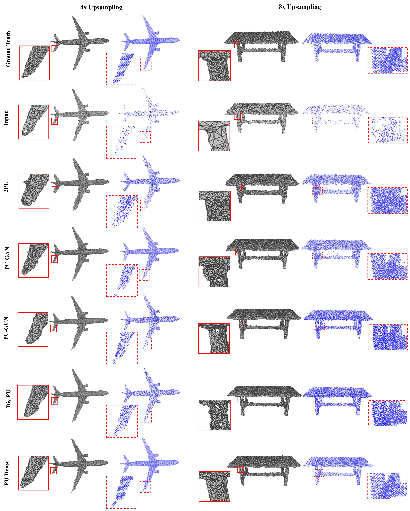

# PU-Dense: Sparse Tensor-based Point Cloud Geometry Upsampling

by [Anique Akhtar](https://aniqueakhtar.github.io/), [Zhu Li](http://l.web.umkc.edu/lizhu/), [Geert Van der Auwera](https://www.linkedin.com/in/geertvanderauwera/), [Li Li](http://staff.ustc.edu.cn/~lilimao/), [Jianle Chen](https://www.linkedin.com/in/jianle-chen-63b9682b/).

## Introduction

This repository is for our paper '[PU-Dense: Sparse Tensor-based Point Cloud Geometry Upsampling](https://aniqueakhtar.github.io/publications/PU-Dense/)'. The code is modified from [PCGCv2](https://github.com/NJUVISION/PCGCv2) and [MinkowskiEngine](https://github.com/NVIDIA/MinkowskiEngine).

**[Project website with details about the work and the visual results](https://aniqueakhtar.github.io/publications/PU-Dense/)**

In this work, we present a novel geometry upsampling technique, PU-Dense, which can process a diverse set of point clouds including synthetic mesh-based point clouds, real-world high-resolution point clouds, 
real-world indoor LiDAR scanned objects, as well as outdoor dynamically acquired LiDAR-based point clouds. 
PU-Dense employs a 3D multiscale architecture using sparse convolutional networks that hierarchically reconstruct an upsampled point cloud geometry via progressive rescaling and multiscale feature extraction. 
The framework employs a UNet type architecture that downscales the point cloud to a bottleneck and then upscales it to a higher level-of-detail (LoD) point cloud. 
PU-Dense introduces a novel Feature Extraction Unit that incorporates multiscale spatial learning by employing filters at multiple sampling rates and field of view. 


<!--- -->

<center><p>
    
</p></center>


## Installation

### Our Environment
- python3.7 or 3.8
- cuda10.2 or 11.0
- pytorch1.6 or 1.7
- MinkowskiEngine 0.4  (Can use MinkowskiEngine 0.5 or higher with a small tweak in the network)

We provide the Conda environment we used in the `./Installation_files`. We have provided both the `environment.yml` file as well as `spec_file.txt` file for easy reproduction of conda environment.

We recommend you follow https://github.com/NVIDIA/MinkowskiEngine to setup the environment for sparse convolution. In our released code, we are employing `MinkowskiEngine 0.4`. 
However, it can easily be updated to `Minkowski Engine 0.5 or higher`. There is minimal syntax changes in the newer version that can be updated in the Network Model.

### Pretrained Models and Datasets
- [Pretrained Models](https://umkc.box.com/s/pohfuxkojai8yqc236nw6ncqzw1qyqm8)
- Training dataset: [ShapeNet Dataset](https://umkc.box.com/s/oyaugew2qfmxkxbgib54po1vjhtmvyid)
- [8iVFB Dataset](http://plenodb.jpeg.org/pc/8ilabs/)
- [8iVSLF Dataset](https://mpeg-pcc.org/index.php/pcc-content-database/8i-voxelized-surface-light-field-8ivslf-dataset/)
- [ScanObjectNN Dataset](https://github.com/hkust-vgd/scanobjectnn)
- [Kitti Dataset](http://www.cvlibs.net/datasets/kitti/)


## Usage
### Training
```
python train.py
```
Please edit the araguments inside the ``train.py`` file to get the best results.

### Testing
```
python eval_8i.py
```
We provide multiple demo evaluation files for each dataset. Some of them employs KD-tree partitions to not run into GPU memory issues.

### Visualize
```
tensorboard --bind_all --logdir ./Upsampling/logs/4x_0x_ks5/  --port 5001
```

### Extra Files
- We provide MPEG's `./utils/pc_error_d` file to be able to calculate the PSNR for the point clouds.
- `./pre_post_processing/Add_Gaussian_Noise.py` file shows how to add Gaussian Noise to the point cloud.
- `./pre_post_processing/Convert_Kitti.py` file converts the raw KITTI point cloud to be converted into a `.ply` file so it can be processed by our network.
- `./pre_post_processing/test_results_GPU.py` file tests the quality of the regenrated point cloud. However, it does require installation of `pytorch3d` to be able to use this file.


## Citation
Accepted at IEEE Transactions on Image Processing (TIP). 2022.
Akhtar, Anique, Zhu Li, Geert Van der Auwera, Li Li, and Jianle Chen. "PU-dense: Sparse tensor-based point cloud geometry upsampling." IEEE Transactions on Image Processing 31 (2022): 4133-4148.

### Questions
Please feel free to contact us with any questions. Feel free to open a new issue in this repository for a quick discussion.


## Authors
A. Akhtar, and Z. Li are with the Department of Computer Science and Electrical Engineering, University of Missouri-Kansas City.

L. Li is with the Department of Computer Science and Electrical Engineering, University of Missouri-Kansas City and also with the CAS Key Laboratory of Technology in Geo-Spatial Information Processing and Application System, University of Science and Technology of China.

G. Van der Auwera and J. Chen are with Qualcomm Technologies Inc., San Diego, CA, USA.
