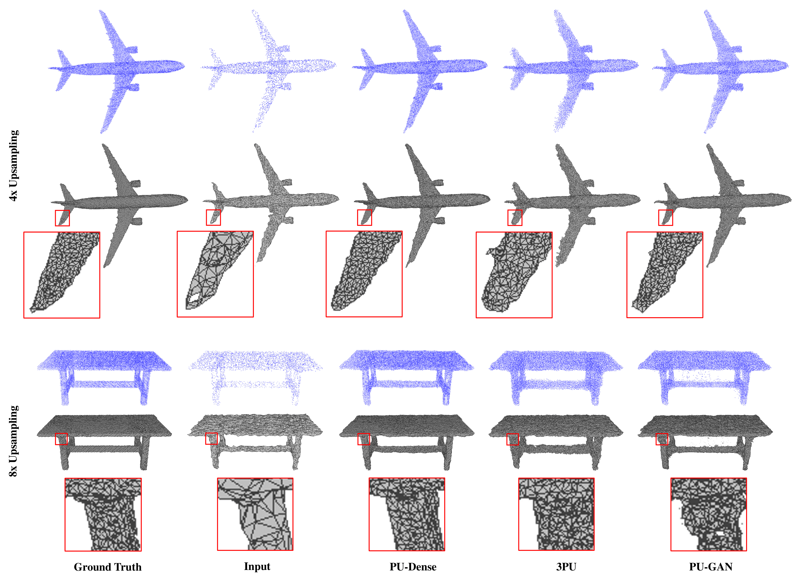

# PU-Dense: Sparse Tensor-based Point Cloud Geometry Upsampling

by [Anique Akhtar](https://aniqueakhtar.github.io/), [Zhu Li](http://l.web.umkc.edu/lizhu/), [Geert Van der Auwera](https://www.linkedin.com/in/geertvanderauwera/), [Li Li](http://staff.ustc.edu.cn/~lilimao/), [Jianle Chen](https://www.linkedin.com/in/jianle-chen-63b9682b/).

## Introduction

This repository is for our paper '[PU-Dense: Sparse Tensor-based Point Cloud Geometry Upsampling](https://aniqueakhtar.github.io/publications/PU-Dense/)'. The code is modified from [PCGCv2](https://github.com/NJUVISION/PCGCv2) and [MinkowskiEngine](https://github.com/NVIDIA/MinkowskiEngine).

**[Project website with details about the work and the visual results](https://aniqueakhtar.github.io/publications/PU-Dense/)**

	
	

## Installation

### Our Environment
- python3.7 or 3.8
- cuda10.2 or 11.0
- pytorch1.6 or 1.7
- MinkowskiEngine 0.4  (Can use MinkowskiEngine 0.5 or higher with a small tweak in the network)

We provide the Conda environment we used in the `./Installation_files`. We have provided both the `environment.yml` file as well as `spec_file.txt` file for easy reproduction of conda environment.

We recommend you follow https://github.com/NVIDIA/MinkowskiEngine to setup the environment for sparse convolution.

### Extra Files
- We provide MPEG's `./utils/pc_error_d` file to be able to calculate the PSNR for the point clouds.
- `./pre_post_processing/Add_Gaussian_Noise.py` file shows how to add Gaussian Noise to the point cloud.
- `./pre_post_processing/Convert_Kitti.py` file converts the raw KITTI point cloud to be converted into a `.ply` file so it can be processed by our network.
- `./pre_post_processing/test_results_GPU.py` file tests the quality of the regenrated point cloud. However, you would need to install `pytorch3d` to be able to use this file.

- Pretrained Models: [Pretrained Models]()
- Training dataset: [ShapeNet Dataset]()
- 8iVFB Dataset: http://plenodb.jpeg.org/pc/8ilabs/
- 8iVSLF Dataset: https://mpeg-pcc.org/index.php/pcc-content-database/8i-voxelized-surface-light-field-8ivslf-dataset/
- ScanObjectNN Dataset: https://github.com/hkust-vgd/scanobjectnn
- Kitti Dataset: http://www.cvlibs.net/datasets/kitti/